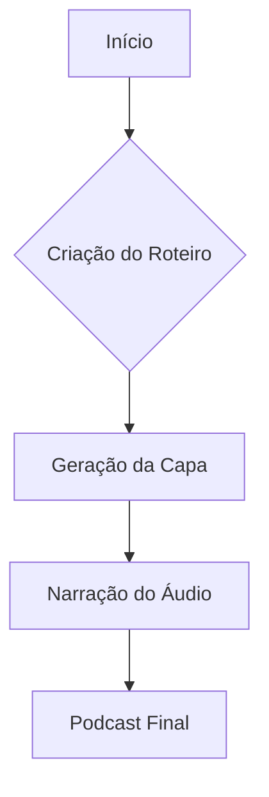

# Projeto: Podcast - Voz, Roteiro e Capa 🎙️

[English Version](./README_en.md)

## 🛡️ Badges
[](https://opensource.org/licenses/MIT)
[](https://galafis.github.io/Criando-um-Podcast-com-IAs-Generativas/)
[](https://github.com/galafis/Criando-um-Podcast-com-IAs-Generativas#tecnologias)
[](https://github.com/galafis/Criando-um-Podcast-com-IAs-Generativas#status-do-projeto)

## 📒 Descrição
Este projeto foi desenvolvido por Gabriel Demetrios Lafis como parte de um desafio da DIO, com o objetivo de criar um **podcast completo**. Como um cientista de dados apaixonado por tecnologia, Gabriel aproveitou a oportunidade para unir criatividade com tecnologia e demonstrar como a inovação pode transformar conteúdo em experiência.

O projeto envolveu a criação de um **roteiro envolvente**, a geração de uma **capa personalizada** e a **narração com voz realista e natural**. O resultado é um podcast cativante, produzido de forma inovadora e com foco na qualidade do conteúdo.

## 🎧 Título do Episódio
**"A Nova Linguagem do Século XXI"**

## 🧠 Roteiro Resumido
1. Introdução: o que é e por que estamos falando tanto sobre isso?
2. No cotidiano: exemplos práticos e invisíveis
3. Impactos profissionais: a revolução do mercado de trabalho
4. Curiosidades sobre a geração de conteúdo
5. Reflexão final: como você pode se preparar para viver (e crescer) com a inovação

## 🔈 Link para o áudio do Podcast
🎙️ [`Clique aqui para ouvir`](./assets/gabriel-demetrios-lafis.mp3)

## 🎨 Capa do Podcast
A capa foi desenvolvida com base em um conceito detalhado que reflete a essência do episódio: moderno, reflexivo e futurista.

<!-- A imagem hero será atualizada em breve para refletir melhor o projeto. -->

## 💬 Prompts Utilizados
Os prompts estão documentados no arquivo [`prompts-utilizados.md`](./docs/prompts-utilizados.md), incluindo:
- Criação do título
- Desenvolvimento do roteiro
- Geração da capa
- Conversão de texto em áudio

## 🌐 Links Relevantes
- [Repositório base do desafio - Felipe Aguiar](https://github.com/felipeAguiarCode/prompts-for-podcast-generate-by-ia)

## 📊 Diagrama de Arquitetura


---

> "A voz pode ser digital, mas o impacto é real. A tecnologia não é apenas uma ferramenta, é uma nova forma de expressar ideias."

Produzido por Gabriel Demetrios Lafis, entusiasta de dados, tecnologia e comunicação inteligente. #Podcast


## 📋 Descrição

Este projeto demonstra a criação de um podcast completo, desde o roteiro até a capa e narração, utilizando princípios de geração de conteúdo. O objetivo é apresentar um fluxo de trabalho inovador para produção de mídia, focado na eficiência e qualidade.

## 📦 Instalação

Este projeto é primariamente demonstrativo e não requer instalação complexa. Para explorar os arquivos:

1.  **Clone o repositório:**
    ```bash
    git clone https://github.com/galafis/Criando-um-Podcast-com-IAs-Generativas.git
    ```
2.  **Navegue até o diretório do projeto:**
    ```bash
    cd Criando-um-Podcast-com-IAs-Generativas
    ```

## 💻 Uso

Para ouvir o podcast, abra o arquivo `index.html` em seu navegador ou acesse o GitHub Pages do projeto. O áudio está localizado em `assets/gabriel-demetrios-lafis.mp3` e os prompts utilizados para a criação do conteúdo estão em `docs/prompts-utilizados.md`.

## 📄 Licença

Este projeto está licenciado sob a Licença MIT. Veja o arquivo [LICENSE](LICENSE) para mais detalhes.

