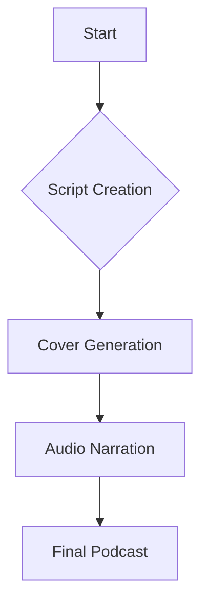

# Project: Podcast - Voice, Script, and Cover 🎙️

## 🛡️ Badges
[](https://opensource.org/licenses/MIT)
[](https://galafis.github.io/Criando-um-Podcast-com-IAs-Generativas/)
[](https://github.com/galafis/Criando-um-Podcast-com-IAs-Generativas#technologies)
[](https://github.com/galafis/Criando-um-Podcast-com-IAs-Generativas#project-status)

## 📒 Description
This project was developed by Gabriel Demetrios Lafis as part of a DIO challenge, with the aim of creating a **complete podcast**. As a data scientist passionate about technology, Gabriel took the opportunity to combine creativity with technology and demonstrate how innovation can transform content into experience.

The project involved the creation of an **engaging script**, the generation of a **custom cover**, and **narration with a realistic and natural voice**. The result is a captivating podcast, produced in an innovative way and with a focus on content quality.

## 🎧 Episode Title
**"The New Language of the 21st Century"**

## 🧠 Summarized Script
1. Introduction: what is it and why are we talking so much about it?
2. In everyday life: practical and invisible examples
3. Professional impacts: the revolution of the job market
4. Curiosities about content generation
5. Final reflection: how you can prepare to live (and grow) with innovation

## 🔈 Link to the Podcast Audio
🎙️ [`Click here to listen`](./assets/gabriel-demetrios-lafis.mp3)

## 🎨 Podcast Cover
The cover was developed based on a detailed concept that reflects the essence of the episode: modern, reflective, and futuristic.

<!-- The hero image will be updated soon to better reflect the project. -->


## 💬 Prompts Used
The prompts are documented in the [`prompts-utilizados.md`](./docs/prompts-utilizados.md) file, including:
- Title creation
- Script development
- Cover generation
- Text-to-audio conversion

## 🌐 Relevant Links
- [Challenge base repository - Felipe Aguiar](https://github.com/felipeAguiarCode/prompts-for-podcast-generate-by-ia)

## 📊 Architecture Diagram


---

> "The voice may be digital, but the impact is real. Technology is not just a tool, it's a new way to express ideas."

Produced by Gabriel Demetrios Lafis, an enthusiast of data, technology, and intelligent communication. #Podcast


## 📋 Description

This project demonstrates the creation of a complete podcast, from script to cover and narration, using content generation principles. The goal is to present an innovative workflow for media production, focused on efficiency and quality.

## 📦 Installation

This project is primarily demonstrative and does not require complex installation. To explore the files:

1.  **Clone the repository:**
    ```bash
    git clone https://github.com/galafis/Criando-um-Podcast-com-IAs-Generativas.git
    ```
2.  **Navigate to the project directory:**
    ```bash
    cd Criando-um-Podcast-com-IAs-Generativas
    ```

## 💻 Usage

To listen to the podcast, open the `index.html` file in your browser or access the project's GitHub Pages. The audio is located in `assets/gabriel-demetrios-lafis.mp3` and the prompts used for content creation are in `docs/prompts-utilizados.md`.

## 📄 License

This project is licensed under the MIT License. See the [LICENSE](LICENSE) file for more details.

